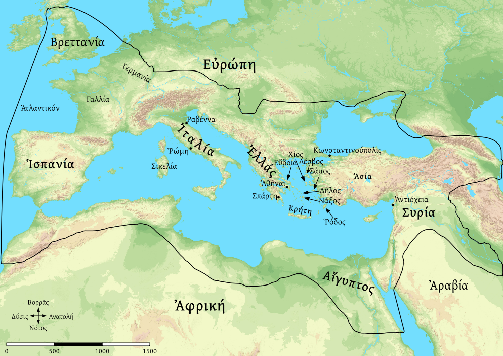

# ΠΕΡΊΟΔΟΣ ΕΥΡΩΠΗΣ

# ΓΡΑΜΜΑΤΙΚΗ

ἐνικὸν καὶ πληθυντικόν

[A]

* ὁ Νεῖλ*ος* ποταμ*ός* ἐστιν.
* ὁ Νεῖλος καὶ ὁ Ρῆνος ποταμ*οί* εἰσιν.

τὸ μὲν ποταμὸς ἐνικόν ἐστιν. τὸ δὲ ποταμοὶ πληθυντικόν ἐστιν.

ἐνικόν· -ος, πληθυντικόν· -οι

[Β]

* ἡ Ἱσπανία ἐπαρχί*α* Ρωμαϊκ*ή* ἐστιν
* ἡ Ἱσπανία καὶ ἡ Συρία ἐπαρχί*αι* Ρωμαϊκ*αί* εἰσιν.

τὸ μὲν ἐπαρχία ἐνικόν ἐστιν. τὸ δὲ ἐπαρχίαι πληθυντικόν ἐστιν.

ἐνικόν· -α/η, πληθυντικόν· -αι

# ΜΕΛΕΤΗΜΑ 'Α

ὁ Νεῖλος μοταμ-- ἐστιν. ὁ Νεῖλος καὶ ὁ Ρῆνος ποταμ-- εἰσιν. ἡ Σικελία ἐστὶν νῆσ--. ἡ Κρήτη καὶ ἡ Σιλεκία ἐστὶ νῆσ--. τὸ Α γραμμ-- ἐστιν. τὸ Α καὶ τὸ Β γραμμ-- ---.

ἡ Σπάρτη πόλ-- ἐστίν. αἱ Ἀθῆναι πόλις ---. ἡ Σπάρτη καἲ αἱ Ἀθῆναι πόλ-- εἰσίν. ἡ Σπάρτη ἐστὶ πόλις Ελληνικ--. αἱ Ἀθῆναι ἐστὶ πόλις Ελληνικ--. αἱ Ἀθῆναι καὶ ἡ Σπάρτη πόλεις Ελληνικ-- εἰσιν.  ἡ Ρώμη οὐ ἐστιν πόλις Ελληνικ--, ἀλλὰ πόλις Ρωμαϊκ--. ἡ Ραβέννα καὶ ἡ Ρώμη εἰσὶ πόλεις Ρωμαϊκ--.

ἡ Ἐλλάς ἐστιν ἐν τῇ Εὐρώπ--. τε καὶ ἡ Ἰταλία ἐστὶν ἐν τ-- Εὐρώπ--. ἡ δὲ Αἴγυπτος ἐν τ-- Εὐρώπ-- οὐκ ἔστιν, ἀλλὰ τ-- Ἀφρικ--. ἆρα ἡ Αντιόχεια ἐν τ-- Ἀσί-- ἐστίν; ναί, ἐν τ-- Ἀσί-- ἐστίν.

τὸ Α καὶ Β γράμ-- εἰσιν. καὶ τὸ Γ ἐστὶ γράμμ--. τὸ μὲν Γ ἐστίν γράμμ-- Ἐλληνικ--. τὸ δὲ C ἔστι γραμμ-- Ρωμαῖκ--. τὸ μὲν C καὶ τὸ D εἰσὶ γραμμ--- Ρωμαϊκ--. τὸ δὲΓ καὶ τὸ Δ εἰσὶ γραμμ-- Ἐλληνικ--.  εἷς καὶ δύο ἀριθ-- ---. τρεῖς ἀριθμ-- ἐστιν. Χίλια μέγ-- ἀριθμ-- ἐστιν. δύο ἐστὶν ἀριθμος μικρ--. τε καὶ εἶς ἐστιν ἀριθμος μικ--. χίλια δὲ μεγ-- αριθμ-- ἐστιν. δύο καὶ εἶς μικρ-- αριθμ-- εἰσιν.

# ΜΕΛΕΤΗΜΑ 'Β

ὁ Νεῖλος --- ἐστιν. ἡ Κρήτη --- ἐστίν. τὸ Α --- ἐστίν. ὁ Νεῖλος --- μέγας ἐστίν. καὶ ὁ Νεῖλος ἐν τῇ --- ἐστιν.  ὁ δὲ Ρῆνος ἐν --- Ρώμῃ ἐστίν. ἡ Σικελία --- ἐστίν. ἡ Ρώμη --- ἐν τῇ Ἰταλίᾳ ἐστὶν. ἡ Σπάρτη --- ἐν τῇ Ἐλλάδι ἐστίν. ἡ Ρώμη καὶ ἡ Σπάρνη --- εἰσίν. ἡ Ρώμη καὶ ἡ Σπάρνη πόλεις ἐν τῇ --- εἰσίν. ἡ μὲν Κρήτη --- μικρά ἐστιν ἐν τῇ Ἐλλάδι. ἡ δὲ Βρεττανία καὶ --- μεγάλη ἐστίν. ἡ Σικελία καὶ ἡ Κρήτη --- μικραί εἰσιν. καὶ ἡ Δῆλος ἐστὶν νῆσος μικρά ἐν --- Ἐλλάδι. η Δῆλος ἐστὶν νῆσος --- τε καί ἡ Κρήτη ἐστὶν νῆσος ---.

# ΜΕΛΕΤΗΜΑ 'Γ

* ποῦ ἐστιν αἱ Ἀθῆναι;
* ἆρα ἡ Σπάρτη ἐν τῇ Ἰταλία εστίν;
* ποῦ ἐστιν ἡ Ἐλλάς;
* ποῦ εἰσιν ὁ Νεῖλος καί ἡ Ἀἴγυπτος;
* ἆρα ἡ Αἴγυπτος ἐν τῇ Ἀσίᾳ εστίν;
* ποῦ εἰσιν ἡ Ρώμη καί ἡ Ραβέννα;
* τίς ἐστιν αἱ Ἀτῆναι;
* τίς ἐστιν εἷς;
* ἆρα τὸ Δ γράμμα Ρωμαϊκή ἐστιν;
* ἆρα δύο μεγας αριθμός ἐστιν;

Some maps, charts, or drawings produced with Map Creator software from fmosoft.com. Used by permission. All rights reserved.
